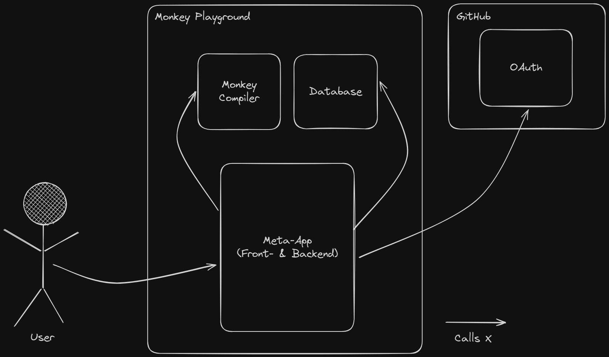
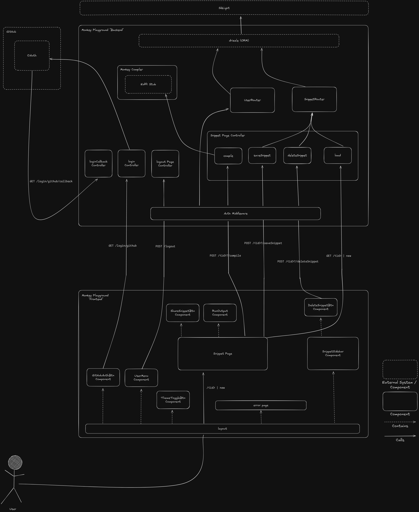
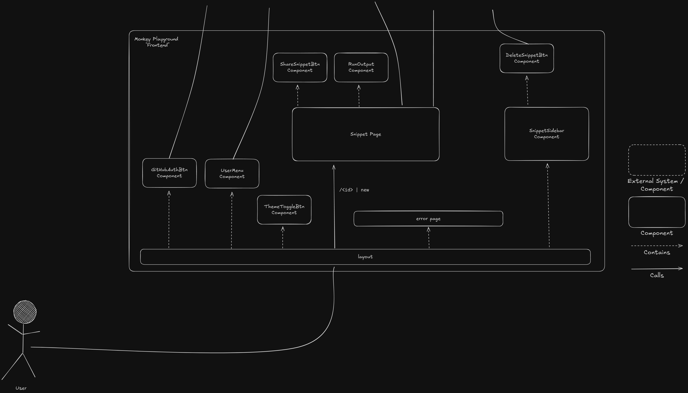
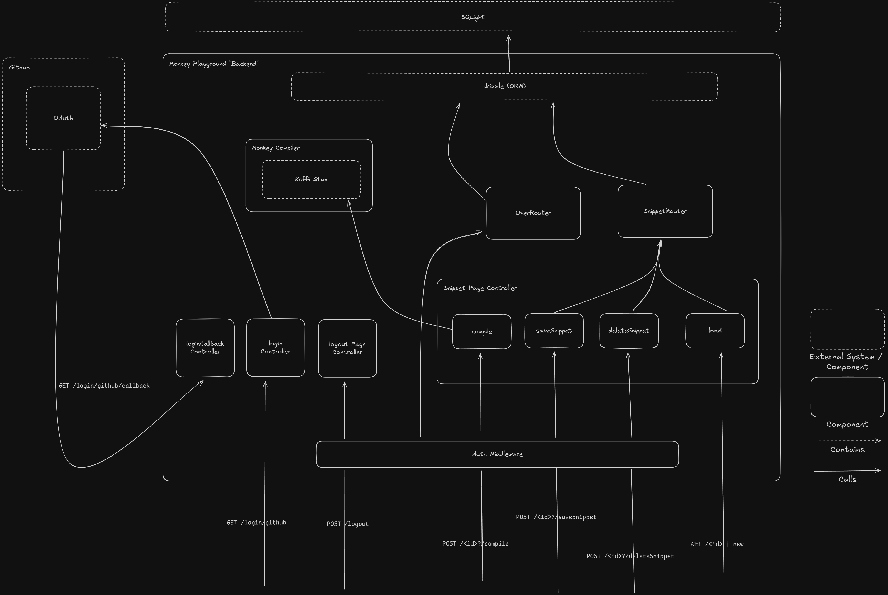
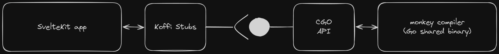

# Documentation

## 1. Introduction

### 1.1 Context

This project was created as the final submission of the _[Web Programming Lab](https://github.com/web-programming-lab)_ class at [HSLU](https://www.hslu.ch/en/). One had the choice of implementing a [Technology Radar](https://github.com/web-programming-lab/web-programming-lab-projekt/blob/main/Technologie-Radar.md) or submitting a custom project idea to demonstrate the learned web-dev skills. I chose the latter with _Monkey Playground_.

### 1.2 Motivation

[Monkey](https://monkeylang.org/) is a fictional programming language used to teach how to write a custom interpreter and compiler from scratch using Go (see the books _[Writing An Interpreter In Go](https://interpreterbook.com/)_ & _[Writing A Compiler in Go](https://interpreterbook.com/)_ by [Thorsten Ball](https://github.com/mrnugget)).
Within the context of these books, one builds a simple REPL (read-eval-print loop) for interacting with the compiler and experimenting with the language. However, this is a bit cumbersome to use and makes it difficult for potentially interested people to try out Monkey.

_Monkey Playground_ aims to solve this by providing a sandbox for writing, compiling, and running Monkey code directly in the browser.
Additionally, signed-in users can save their Monkey snippets and share them with potential future Monkey enthusiasts.

## 2. Context & Scope

### 2.1 Scope

As part of the project definition, the project functionality had to be documented as user stories and prioritized according to the _MoSCoW_ technique.
These stories are listed below, along with their status as of the project submission. The concrete details of each story can be found
[here](./requirements.md).

| Nr. | Story                                  | Priority | Status             |
| --- | -------------------------------------- | -------- | ------------------ |
| 1   | Writing & Running Monkey Code          | Must     | Done ✅            |
| 2   | Sign-up/Sign-in                        | Must     | Done ✅            |
| 3   | Saving Code Snippets                   | Must     | Done ✅            |
| 4   | Overview & Display Saved Code Snippets | Must     | Done ✅            |
| 5   | Share Code Snippets                    | Should   | Done ✅            |
| 6   | View Bytecode of Executed Code         | Could    | Not implemented ❌ |
| 7   | View AST of Executed Code              | Could    | Not implemented ❌ |
| 8   | Delete Code Snippets                   | Should   | Done ✅            |

The deletion functionality of code snippets wasn't covered in the initial scope. Since it is an essential functionality, which enriches the user experience,
it was added in an agile manner to the project's scope. In this regard, stories _6_ & _7_ were pushed back due to their prioritization. In the end, they
weren't implemented, as the overall time budget had already been exceeded by a significant margin. These stories were intended as _"filler"-stories_ in the first
place, which could have been implemented if the other stories hadn't filled the time budget (hence their prioritization and disbandment in the end).

### 2.2 Technical Context

The project is mainly based on a "Meta"-application that combines the frontend with the backend in an end-to-end manner. In other words, these types of
apps support multiple rendering modes (server-side, client-side, static, etc.) and can utilize them in various combinations at different stages in the
lifecycle of the app. The backend part of the app utilizes the encapsulated _monkey-compiler_ to compile and run code. Additionally, it calls the
_database_ to fetch or update data.

For authenticating a user, they are forwarded to the _GitHub OAuth_ flow. After completing it, the user is redirected back to our app, and the verified user
information is fetched (Note: the depiction above only illustrates the dependency on GitHub and doesn't visualize the actual flow the user takes).

## 3. Solution Strategy

### 3.1 Technological Decisions

#### 3.1.1 Meta-App - [SvelteKit](https://svelte.dev/docs/kit/introduction)

The initial idea was to build a classical SPA (single-page application) with a Go REST-API, since my [monkey-compiler](https://github.com/ruegerj/monkey)
is written in Go and thus would have integrated neatly. However, the project constraints required JavaScript as the language for both the front- and backend.

Since it isn't intended to offer the compilation and execution of Monkey code as a service for other applications, there isn't an inherent need
for an SPA/REST-API separation. However, a coding sandbox requires quite an interactive UI. With these points taken into consideration, the obvious choice would
be a "Meta"-framework to utilize different rendering strategies dynamically and streamline the communication between the client and server. For quite
some time, I had Svelte(Kit) on my radar of UI-frameworks I'd like to try out - especially due to its simple yet elegant syntax and structure. Therefore, the
choice fell on SvelteKit as the utilized meta-framework. Svelte is, in comparison, rather the underdog in the realm of JavaScript frameworks. However, it is
backed by [Vercel](https://vercel.com/), making it a somewhat sustainable choice nevertheless.

#### 3.1.2 Database - [SQLite](https://www.sqlite.org/)

SQLite offers the unique property of a fully-fledged RDBMS (relational database management system) in a single file - without an external executable or
db-server. The use case of Monkey Playground doesn't require a huge database nor complex queries and isn't expected to scale rapidly. Additionally, I
wanted to have a single-container deployment for the application to make it portable and easy to use/deploy. SQLite makes a good fit for those
needs. Additionally, projects like [PocketBase](https://pocketbase.io/), [Turso](https://turso.tech/), and many others showcase the quite astounding performance
potential of SQLite.

#### 3.1.3 ORM - [drizzle](https://orm.drizzle.team/)

I searched for a performant, simple, and easy-to-use ORM (Object-Relational-Mapper), which has built-in support for migrations and SQLite. In the end, I
landed on drizzle, which is currently one of the go-to ORMs in the JS realm. It performs very well on benchmarks, supports a multitude of runtimes, and comes
with some additional goodies to improve the developer experience. Since it's a "hot" new library, it bears the inherent risk of falling out of favor and getting abandoned. However, the data schema of Monkey Playground is quite trivial, making a potential shift to a new ORM in the future not
too painful.

#### 3.1.4 UI - [TailwindCSS](https://tailwindcss.com/) / [shadcn-svelte](https://www.shadcn-svelte.com/)

The decision for the UI backbone fell on Tailwind due to its enormous flexibility and adaptivity, while maintaining a nicely coherent design system. The
utility classes offer a streamlined "SCSS" experience, allowing easy styling of elements faster and more consistently.

Shadcn-svelte is a component library that was ported from [React](https://ui.shadcn.com/) to Svelte. It offers a wide range of prebuilt UI components which
speed up the development time immensely. The unique trait of this library is that you "install" the components as source code into your repository, making
yourself the owner and allowing you to customize the components to your liking. It is also built with TailwindCSS and, therefore, forms an
interlocking system for creating a UI.

#### 3.1.5 Icons - [unplugin-icons](https://github.com/unplugin/unplugin-icons)

The decision for an icon library is often a hard one, since you like some of the icons but not all of them. Additionally, most icon libraries ship as a whole
and don't (easily) allow including only the used icons in the bundled build of the application. Unplugin-icons solves all of this, since it isn't an
icon library itself but an _icon-bootloader_ for [Iconify](https://github.com/iconify/iconify) - which offers 150+ different icon sets. It allows importing
any icon from any library and includes only the ones actually used in the application (tree-splitting) in the final build.

#### 3.1.6 Authentication - [GitHub OAuth](https://docs.github.com/en/apps/oauth-apps/building-oauth-apps/creating-an-oauth-app) / ([LuciaAuth](https://lucia-auth.com/))

Rolling custom authentication comes with a lot of considerations and potential footguns (in the context of security). Since most of the people interested
in Monkey code will be fellow developers or people with a fondness for IT - most of them will own a GitHub account. Therefore, utilizing GitHub OAuth in order
to outsource the authentication, as well as to manage personal information about the users, is a neat solution for this use case. Additionally, the user gets
easy and fast access to the app and won't have to create yet another account for an online tool.

LuciaAuth is not a tool per se, but a guide on how to implement authentication/authorization properly in modern web apps. For Monkey Playground, it was used
for guidance in realizing the OAuth adapter for GitHub and integrating the authorization part into SvelteKit. Since SvelteKit is a full-stack framework, I
opted for a session-based cookie approach to simplify the storage of the session ID on the client side.

## 4. Building Block View

> Note: SvelteKit is a full-stack framework - some parts can run on both the client and server (due to the different rendering modes). This section tries to
> dissect it nevertheless into a "frontend" and "backend" view for better comprehensibility.

### 4.1 Frontend

> All imported _shadcn-svelte_ components were omitted from the diagram to enhance readability

The frontend is kept rather simple. There is one main route `/<id>` pointing to a snippet with the given id. If a new snippet should be created, the
_id_-parameter has the value `new`. The form actions for saving (e.g. creating or updating) a snippet and compiling & running the code of it, are embedded in
this page.

Every page of the app is rendered as a child of the _layout_ page, which defines the global layout. It hosts various functionality:

- user menu (when signed in)
- GitHub auth btn (when signed out)
- theme toggle btn

Additionally, it hosts the snippet sidebar menu, which displays all saved snippets of a signed-in user and offers the option to delete them individually
(form action). If any error occurs while processing a request on the server (e.g. an error status code is returned), the global error page is displayed instead
of the page content.

### 4.2 Backend

In SvelteKit, every route has its own dedicated page-"controller" that handles the incoming requests for its route. The _auth-middleware_ checks and
validates session-cookies for all incoming requests (all routes going "through" the middleware demand a valid session & signed-in user). The controllers
are responsible for the validation of the request data and managing the returned response. The available routes and their HTTP verbs are displayed in the
diagram above. The `load` routes for a page are a special endpoint used by SvelteKit to (re-)fetch the data needed for rendering the page.

The two _\*Router_ components represent [repositories](https://martinfowler.com/eaaCatalog/repository.html), which provide the CRUD (Create, Read, Update,
Delete) operations for their respective entity. To do that, they utilize drizzle as an ORM (Object Relational Mapper), which then connects to the actual
SQLite database.

## 5. Runtime View

### 5.1 Startup Actions

When the application starts up, the following actions take place when the first request hits the server:

- **DB Connection:** gets "established," meaning that the SQLite file gets read and interpreted by the driver.
- **DB Migrations:** drizzle checks the database's current structure and if there are any pending migrations. If this is the case, they'll be executed..
- **Monkey Compiler:** the binary gets loaded into memory by Koffi, and the necessary stubs are instantiated and registered for the binary (more on that in the
  following chapter).

### 5.2 FFI for Monkey Compiler

To directly integrate and call functions from my Go monkey-compiler, the app makes use of _Foreign Function Interfaces_ (FFI). In that setup, the
compiler defines a ["C-like" API facade](https://github.com/ruegerj/monkey/blob/main/api/external/main.go) with the necessary type definitions. The Go
compiler is compiled as a _shared-object_ file (.so/.dylib /.dll) using the [cgo](https://pkg.go.dev/cmd/cgo) package from Go's std lib. The C-like type-
definitions act as function stubs, which can be called externally.

In SvelteKit, the [Koffi](https://koffi.dev/) library is used for loading the shared-object binary into memory. The same types and function stubs are
replicated. Thus, the app can directly call all functions exposed by the monkey-compiler's dedicated C-like API. The API is designed to pass values
_by-value_ to prevent any memory management issues.

## 6. Deployment View

Docker is the de facto standard for shipping applications today. It standardizes the infrastructure the code runs on within a container and facilitates the
execution of a diverse range of applications with different requirements on a single host machine. Since Monkey Playground ships with binaries of the
monkey-compiler that are compiled for a certain operating system and C-toolchain (_clang_), Docker offers a consistent and stable platform that can be
configured to specific needs.

To run a Docker container for Monkey Playground, you simply need to define a volume for hosting the SQLite database and supply the necessary
environment variables. See the [according section](../README.md#docker) in the README for further information and instructions.

## 7. Quality

The following minimal quality goals apply to Monkey Playground:

- **Performance:** requests shouldn't take longer than 500ms, with the exceptions: calls to external systems (GitHub, monkey compiler), cold-start
- **Usability:** the UI should be designed in a way that enables users on desktop and mobile devices to use the app comfortably.

## 8. Risks & Technical Debt

| Title                     | Description                                                                                                                                                                                       | Kind    | Estimate (h) |
| ------------------------- | ------------------------------------------------------------------------------------------------------------------------------------------------------------------------------------------------- | ------- | ------------ |
| Improve accessibility     | Improve the app's accessibility to an "appropriate" standard for a coding sandbox                                                                                                                 | Feature | 5h           |
| Increase test coverage    | Create a test setup allowing for isolated db-instances that can be seeded by a predefined fixture of data. This would allow writing e2e tests, covering all actions including database operations | Fix     | 10h          |
| Persist code through auth | Currently, the snippets content is lost when an unauthenticated user signs in                                                                                                                     | Feature | 3h           |

If this application needed to scale to a large number of users, concurrently compiling large code snippets (rather unlikely given the project's nature and
context), the backend architecture would have to be reconsidered to support high-performance needs.

## 9. Reflection

All in all, it was an enjoyable project to work on. It allowed me to sharpen my web fundamentals while trying out a stack of new technologies I'd never worked with before. One of these was SvelteKit, which really won me over during this project. Compared to other frontend frameworks, it is easy and straightforward to make state reactive and share data between components. Additionally, it boosts development efficiency by providing end-to-end type safety for backend responses, environment variables, and so forth.

However, the state management was sometimes a bit "too easy" for me, since at the beginning, I found it hard to grasp which state was changed when on a page with multiple [form actions](https://svelte.dev/docs/kit/form-actions), which trigger incremental state updates depending on how the request handler is implemented. Once I understood the fundamental concepts of the framework, working with it was a breeze.

A rather tricky part of the application was the integration of the monkey-compiler as an external binary. During the conception of the project, I found an article showing how to create "C-bindings" in the Go binary so that it can be called by other languages. Go provides the [cgo](https://pkg.go.dev/cmd/cgo) package, which offers a nice way to create such bindings.

The challenge came from the Node.js side of things. The npm package used in the blog post hadn’t been maintained for some years and threw some nasty C++ exceptions during runtime. This required multiple attempts with other packages and some thorough research. At one point, I thought I would have to pivot since it didn't seem like it was going to work. But luckily, I found [Koffi](https://koffi.dev/) in the end, which worked out of the box without any major headaches.

This process led to the fact that my first vertical cut took more time than initially anticipated. However, it led me down an interesting path of FFIs and C-bindings for using libraries in foreign languages.

I'm not too well-versed in UI design, so this was another big time-eater. The fact that I have a bit of a perfectionist streak didn't help, since I wanted to design a nice-looking UI that was responsive and usable on mobile devices as well. However, both TailwindCSS and shadcn-svelte helped me quite a bit by providing an easy-to-work-with toolset and nicely styled and responsive components.

For a future project of this kind, I would consider more carefully when deciding how many new technologies I want to try out and the correlating time effort. Nevertheless, I'm very happy with the outcome and can say that I got to know many interesting technologies and concepts while implementing Monkey Playground.

## 10. Work Journal

The detailed work journal can be found [here](./work-journal.md).
