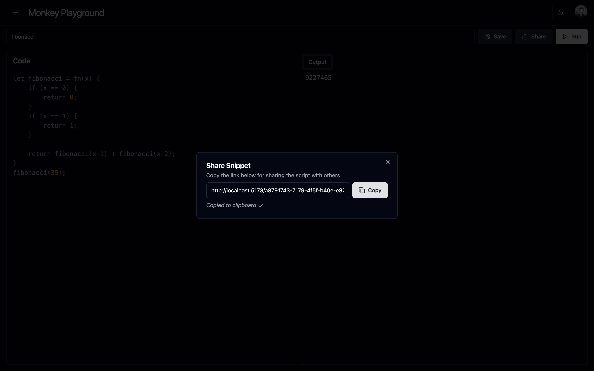

# Monkey Playground - Screenshots

Here are some visual impressions of the current monkey playground app and its features.

## Snippet Editor (dark-theme)

## Snippet Editor (light-theme)

## Saved Snippets Sidebar

## Delete Snippet Confirmation Dialog

## Share Snippet Dialog

## Shared Snippet View for anonymous user

## Error page

